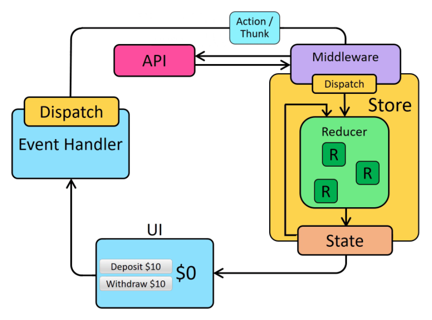

## Redux

### 不錯的文章

https://chentsulin.github.io/redux/index.html


### 概念

Redux的資料流向無論同步還是非同步都只有一種（不像 Vuex的 View可以呼叫 `actions`(使用`dispatch`)及 `mutations`(使用`commit`)兩種）

資料流向：

`View` -> `Actions` -> `Reducer` -> `State` -> `View`

雖然說概念上只一種資料流，但實作上 `Action`還是分為「**同步**」和「**非同步**」兩種的做法。Redux原生 `dispatch`是直接呼叫 `reducer`，所以無法執行非同步的操作（ `reducer`中非同步操作是被禁止的），要額外搭配 Redux-Thunk才能使用非同步的操作




實作上所必要的套件有以下三個：

Redux：狀態管理本身

Redux-Thunk：實作 middleware處理非同步行為（Redux本身是不允許處理非同步的）

React-Redux：將 Redux跟 Component綁定（提供`Provider`將  `state`及 `dispatch`傳入 Component）


### State & Reducer

* State：`state` 是唯讀的，改變 `state`唯一的方式是發出一個 `action`
* Reducer：取得先前的`state`和一個 `action`，並回傳下一個 `state`

最簡易範例：

```js
// state
const initState = {
  otherState: 'otherState',
  todoList: ['first'],
};

// reducer
const reducer = (state = initState, action) => {
  switch (action.type) {
    case 'ADD_TODOLIST': {
      const todoList = state.todoList.map(d => d);
      todoList.push(action.payload.listName)
      return {
        ...state, // 因為要更新所有的 state，所以必須先將原本的 state解構
        todoList,
      };
      /* 或者 return的寫法也可這樣
      return Object.assign({}, state, {
        todoList
      })
      */
    }
    default:
      return state;
  }
};
```

其中要注意的：

1. `reducer` 在更新 `state`的時候並不能只更新特定欄位，必須更新整個 `state tree`，所以要注意 return的寫法

2. `reducer` 本身不能做非同步的操作，否則會噴錯誤訊息


處理多個 `action`的範例：

```js
function todoApp(state = initialState, action) {
  switch (action.type) {
    case SET_VISIBILITY_FILTER:
      return {
      	...state, 
        // 略
      }
    case ADD_TODO:
      return {
      	...state, 
        // 略
      }
    default:
      return state
  }
}
```

拆分 `Reducers`：

Redux提供一個 utility叫做 `combineReducers()`，可以簡單的將多個 `reducer`合併

```js
import { combineReducers } from 'redux'

const todoApp = combineReducers({
  visibilityFilter,
  todos
})

export default todoApp
```


### Action

`action` 是一個要傳遞資料給 `store`的 payload資訊（透過`store.dispatch()`），其定義事件要做的事情，格式可自行定義，一般來說會長這樣：

```js
export const ADD_TODO = 'ADD_TODO'

const action = {
  type: ADD_TODO // Reducer的type名稱
  payload // '要傳遞的資料'
}
```

當 Views要跟 `store`溝通，最簡易的寫法就是 `store.dispatch(action)`，例如：

```js
store.dispatch({
  type: 'ADD_TODO' // Reducer的type名稱
  payload // '要傳遞的資料'
})
```


### Action Creator

`action creator`和 `action`很容易被混為一談，`action creator` 是產生 `action`的 function

```js
export const ADD_TODO = 'ADD_TODO'

export const addTodo = (payload) => {
  return {
    type: ADD_TODO,
    payload
  }
}
```


由 View發出 `dispatch`時的寫法：

```js
dispatch(addTodo(payload))
```


~~由於每次都要寫成一串 `dispatch(actionCreator())`，有一種做法是把 `dispatch` 和 `action creator`綁在一起，稱作 `bound action creator`~~

```js
const boundAddTodo = (text) => dispatch(addTodo(text))

boundAddTodo(text)
```


### Async Action Creator（使用Redux-Thunk）

Redux原生是禁止非同步操作的，搭配 `Redux-Thunk` 套件我們可以用來製作 「**非同步的 Action Creator**」。當一個 `action creator`回傳的不是物件（也就是 `action`）而是一個 function時，該 function就會被  `Redux Thunk middleware`所執行。

關於這個 `async action creator`所以回傳的 function：

* 執行完非同步的操作後調用 `distach` 

* 不需要是 pure function，也可以做其他的操作，這讓我們也可以用來開發更複雜的非同步控制流程

範例：

```js
const fetchData = (data) => {
  return (dispatch) => {
    // 不需要是 pure function，也可以做其他同步的操作
    dispatch({
      type: 'ANOTHER_ACTION'
    })
    
    return fetch('http://www.website.com/api/todolist.post', {
      method: 'POST',
      body: JSON.stringify(data)
    }).then(response => response.json())
      .then(response => {
        dispatch({
          type: 'ADD_TODOLIST',
          payload: response
        })
      }))
  }
}
```

Views中發出 `dispatch`的寫法：

```js
store.dispatch(fetchPosts('reactjs')).then(() =>
  console.log(store.getState())
)
```

~~思考：~~

~~`async action creator` 適不適合如前面所提到的 `bound action creator`的寫法呢？~~

```js
// actions.js
export const boundFetchPost = ((text) => store.dispatch(fetchPosts(text))))

// view.js
import { boundFetchPost } from '@/store/action.js'

boundFetchPost('reactjs')
	.then(() =>
    console.log(store.getState())
```


### store

`createStore` 寫法範例

```js
import thunkMiddleware from 'redux-thunk'
import createLogger from 'redux-logger'
import { createStore, applyMiddleware } from 'redux'
import rootReducer from './reducers'

const loggerMiddleware = createLogger()

const store = createStore(
  rootReducer,
  applyMiddleware(
    thunkMiddleware, // dispatch() function
    loggerMiddleware // log action
  )
)
```

常用 Methods：

`getState()`

`dispatch(action)`

`subscribe(listener)`


### React-Redux

React-Redux 是 react跟 redux溝通用的套件，舊版主要是以`connect` 函式將 `state`和 `reducer`注入Component，v7.1.0之後的版本提供 `Hooks`語法，使用方式比以前簡單很多

官網文件

https://react-redux.js.org/api/hooks

介紹

https://medium.com/enjoy-life-enjoy-coding/react-redux-%E5%B0%8F%E5%AD%A9%E5%AD%90%E6%89%8D%E5%81%9A%E9%81%B8%E6%93%87-hooks-%E5%92%8C-redux-%E6%88%91%E5%85%A8%E9%83%BD%E8%A6%81-1fdd226f5d99

Provider設定

```js
// app.js
import { createStore } from 'redux'
import { Provider } from 'react-redux'
import reducer from '@/store/reducer.js'

const store = createStore(reducer)

const App = () => {
  return (
    <Provider store={store}>
      <Main />
    </Provider>
  )
}
```


React 和 Store 溝通主要是 `state`和 `action`，`React-Redux`提供了 `useSelector`以及 `useDispatch`，範例如下：

```js
import { useSelector, useDispatch } from 'react-redux'

const Page = () => {
  const todoList = useSelector(state => state.todoList)
  const dispatch = useDispatch()
  // 略
}
```


### next-redux-wrapper

Redux 使用在 Next.js上時，server-side 取用網站的 config或者 state資料都需要透過 `context`來取得，但是 Redux的 `store`是沒有在 `context`內的，這時候我們就需要額外安裝 `next-redux-wrapper`

依賴 `react-redux`套件，並且要注意版本在 v7.x以上

首先有個小坑要注意，使用 `next-redux-wrapper`之後，雖然仍然使用 `react-redux`的 `useSelector`及 `useDispatch`來跟 `Store`溝通，但`react-redux`的 `Provider`就不需要加上去，否則 `state`的更新上會出現 bug。


* store.js

```js
// store.js
import { createStore, AnyAction, Store } from 'redux';
import { createWrapper, Context, HYDRATE } from 'next-redux-wrapper';

// create your reducer
const reducer = (state = {tick: 'init'}, action) => {
    switch (action.type) {
        case HYDRATE:
            // Attention! This will overwrite client state! Real apps should use proper reconciliation.
            return {...state, ...action.payload};
        case 'TICK':
            return {...state, tick: action.payload};
        default:
            return state;
    }
};

// create a makeStore function
const makeStore = (context) => createStore(reducer);

// export an assembled wrapper
export const wrapper = createWrapper(makeStore, {debug: true});
```

`getStaticProps`或 `getServerSideProps` 發出 dispatch時 type為 `HYDRATE`


* app.js

```js
import React from 'react';
import { wrapper } from '../components/store'

const WrappedApp = ({ Component, pageProps }) => (
    <Component {...pageProps} />
);

WrappedApp.getInitialProps = wrapper.getInitialPageProps(store => ({ Component, ctx }) => {
  // 略
})

export default wrapper.withRedux(WrappedApp)
```

關於 `getInitialProps`、`getStaticProps`、`getServerSideProps` 等的寫法參考官方文件：

https://github.com/kirill-konshin/next-redux-wrapper#server-and-client-state-separation


* reducer

reducer的設定是其中比較神秘的部份，必須在 reducer 的 function裡 switch-case的「**最上方**」（也就是要在第一個做判斷）增加判斷 `action.type`為 `HYDRATE`，就我的理解這個是在`getStaticProps`或 `getServerSideProps`  執行時會自動被 `dispatch`，要在這邊更新 server-side（或者 static site的 build-time）中的 `state`。

此時 `action`裡會有一包 `payload`物件，裡面是更的 `state`，要用他來取代表舊的 `state`。

如果 `reducer`是最外層的話（rootReducer），寫法範例如下：

```js
import initState from './state.js'
import { HYDRATE } from 'next-redux-wrapper'

export const reducer = (state = initState, action) => {
  switch (action.type) {
    case HYDRATE: {
      return {
        ...state, // 原本的 state
        ...action.payload // 更新的 state
      }
    }
    // 略… 其他 case
```

要注意的是，即使該 `reducer`並不是對應到 state-tree最底層（比如使用了 `combineReducers`），**reducer中注入的 `state`及 `action.payload`卻仍然是最底層的 `state`**，所以這時候就要注意回傳 state-tree的節點位置

```js
// store.js
import { createStore } from 'redux'
import { combineReducers } from 'redux'
import { createWrapper } from 'next-redux-wrapper'
import auth from './auth/reducers.js'

const makeStore = (context) => createStore(
  combineReducers({
    auth
  })
)
export const wrapper = createWrapper(makeStore, { debug: true })

// reducer.js
import initState from './state.js'
import { HYDRATE } from 'next-redux-wrapper'

const auth = (state = initState, action) => {
  switch (action.type) {
    case HYDRATE: {
      return {
        ...state.auth, // 注意！要回傳正確的 state-tree的節點位置
        ...action.payload.auth // 注意！要回傳正確的 state-tree的節點位置
      }
    }
    // 略… 其他 case
  }
}

export default auth
```


## CLSX

可以在 `className`當中放入多個樣式，和 vue原生就提供的寫法類似

介紹：

https://www.coder.work/article/5916616


### universal-cookie

https://www.npmjs.com/package/universal-cookie

可同時使用在 server-side和 client-side

Browser Example

```js
import Cookies from 'universal-cookie';
const cookies = new Cookies();
cookies.set('myCat', 'Pacman', { path: '/' });
console.log(cookies.get('myCat')); // Pacman
```

Server Example

```js
import Cookies from 'universal-cookie';
const cookies = new Cookies(req.headers.cookie);
console.log(cookies.get('myCat')); // Pacman or undefined if not set yet
```


### PropTypes

用來檢查 props型別，介紹：

https://ithelp.ithome.com.tw/articles/10253299

我是沒有用，想說要檢查型別乾脆寫 typescript (?)

