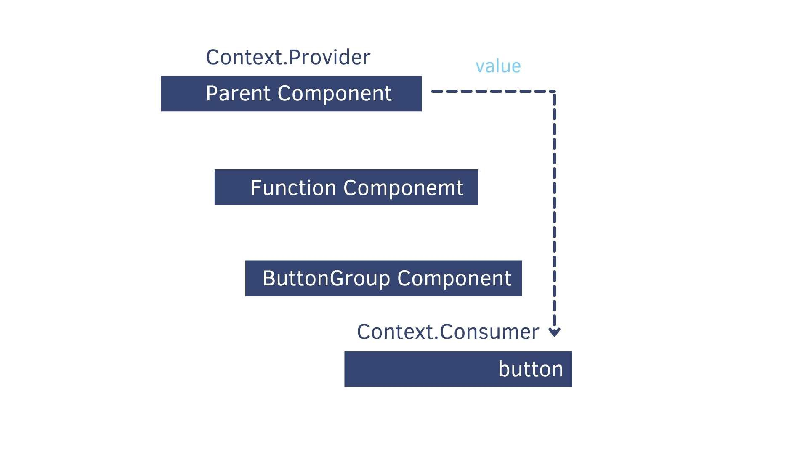

## 相關連結

官網文件 - React頂層API

https://zh-hant.reactjs.org/docs/react-api.html


## React vs Vue

### functional vs MVVM

React：view = func(state)

Vue：MVVM

### Pull更新 vs Push更新

React：Pull更新

* `this.setState({value: 3})`

* **State是不可變的**，需用新的 State-tree全部取代舊的 State-tree，再經由React內部的演算法比較全部的 virtual DOM差異。

* 需額外手動優化效能，以避免不必要的 rerender。

Vue：Push更新

* `this.value = 3`

* 各別元素監聽 State的更新，以響應式的機制更新局部節點的 DOM。

* Vue內部已完成所有的效能優化，不需手動優化效能。

### 手動優化 vs Do nothing？

React：手動優化

* Render function 中盡量減少執行次數和計算量。

* 主要的做法是將不必要的元素製作成 Stateless Component（使用 React.memo）

Vue：Do nothing？

### Controlled Element vs Two-way binding

React：Controlled Element

* React 的 State是不可變的，必須透過 setState函式變更（實際上是替換掉），所以是以單向資料流的方式來完成。

* 實作上需要手動寫監聽事件將元素的 Value更新到 State。

```jsx
state = { term: '' }
render () {
  return (
    <input
      type="text"
      value={this.state.term}
      onChange={e => this.setState({ term: e.target.value })}
    />
  )
}

```

Vue：Two-way binding

* Vue有和「雙向綁定」的方式，可以簡單的達到和 React 的 Controlled Element一樣的效果。

* 是以直接監聽資料變更，以響應式的方式來綁定資料。

```vue
<input
  type="text"
  v-model="term"
/>
```

### props.fn (Callback) vs Emit

React：props.fn (Callback)

* React 的資料流向只能從父層 Component 透過 Props 流向子 Component，所以當子 Component需要將資料傳遞過父層時，得透過 Props傳入的 Callback Function回傳回去。

```jsx
// parent
const App = () => {
  const handleClick = (evt) => {
    console.log(evt)
  }
  return (
    <div>
      <AppButton onClick={handleClick}></AppButton>
    </div>
  )
}

// child 
const AppButton = ({ onClick = () => {} }) => {
  return <button onClick={onClick}>Click Me</button>
}
```

Vue：Emit

* 父傳子 -> Props

* 子傳父 -> Emit

### props.children vs <slot>

React：props.children

* 巢狀Component中，子Component會作為props.children傳入父Component

```jsx
const Child = ({ name }) => (
  <h1>{`Hello ${name}`}</h1>
);
const Parent = ({ children }) => (
  <>
    <Something />
      {children}
    <OtherThings />
  </>
);
const Page = () => (
  <div>
    <Parent>
      {/* <Child/>會作為 props.chilren傳入<Parent/>中 */}
      <Child name="world"></Child>
    </Parent>
  </div>
);
```

Vue：<slot>

* 巢狀Component中，子Component會傳入父Component的 <slot>元素中

```vue
<template>
  <!– Child.vue -->
  <h1>Hello {{name}}</h1>
</template>
<template>
  <!– Parent.vue -->
  <div>
    <Something />
      <slot></slot>
    <OtherThings />
  </div>
</template>
<template>
  <!– Page.vue -->
  <div>
    <Parent>
      <Child name="world"></Child>
    </Parent>
  </div>
</template>
```

### Hooks vs Composition-api

React：Hooks

* 具有狀態(State)的可邏輯重用的函式寫法。

* 解決同一個程式邏輯分散在不同生命週期裡的問題（因為 Function Component不需要生命週期）。

Vue：Composition-api

* 可邏輯重用的函式化Component API。

* 可以較容易的把相同邏輯的程式整理在一起。

* 對Typescript的支援度較好。

### CSS-in-JS vs .css file

React：CSS-in-JS

* React 社群多使用 css-in-js方式編寫UI樣式，但[也有人主張傳統的](https://gajus.medium.com/stop-using-css-in-javascript-for-web-development-fa32fb873dcc)[ ](https://gajus.medium.com/stop-using-css-in-javascript-for-web-development-fa32fb873dcc)[css](https://gajus.medium.com/stop-using-css-in-javascript-for-web-development-fa32fb873dcc)[文件比較好](https://gajus.medium.com/stop-using-css-in-javascript-for-web-development-fa32fb873dcc)。

* 有跨平台優勢。

* 效能可能會較差一些。

* 目前最多人使用的套件是 styled-components。

Vue：.css file

* Vue原生對於 css module支援度就很好，不需額外搭配套件就能整合的很好。

* Vue 也可以額外搭配套件用 css-in-js的方式編寫樣式，但較少人這樣做。

### 個人見解

* **以前端工程師來說：**雖然 React學習曲線較陡但不會是個問題，（可能）會覺得寫起來蠻有趣的。

* **非前端工程師但想寫一點前端的人來說：**想要快速建立一個簡單的網頁，雖然一開始可能會有不難的錯覺，但隨著需求愈來愈複雜會一直遇到愈來愈多的障礙，（很有可能）會寫得很痛苦。

* **對設計師來說：**雖然JSX不難，但如果想寫一點 js做點互動效果對設計師來說就有點不太友善了。如果在團隊裡設計師需要切版的話，可以切純靜態的版 + css file；如果要用 css-in-js（現在 React社群流行的寫法），可能就必須將切版工作交給工程師了。

* **以團隊來說：**前期的時候可能需要花多一點心思建置環境、以及建立團隊的程式規範（否則每個人的寫法會差異很大）。

* **總的來說：**React做的到的事情 Vue也做的到（只是背後的思考邏輯不太一樣而已）。個人覺得寫 Vue的開發體驗還是會比較愉快一點，因為可以用較簡易的方式就達到同樣的目的。而且在 Vue v3.x之後，React的「有彈性」的特性似乎也沒有特別的優勢。


## Hello World

```html
<div id="root">
</div>
```

```js
ReactDOM.render(
  <h1>Hello, world!</h1>,
  document.getElementById('root')
)
```


## JSX

JSX 是一個**直接寫在** **javascript**中的擴充語法，會透過 Babel編譯成 React 用來建立 Element的函式。

React 的 Element並不是真的 DOM，他是一種「virtual DOM」。所有的真實DOM的改變都是經由改變**virtual DOM**之後，經由**diff**演算法批次改變 DOM的內容。

```jsx
const content = (
  <TalkList>
    { talks.map(talk => <Talk talk={talk} />)}
  </TalkList>
)
```

大部份的 attribute和原來的 html都長得一樣，只是轉為小駝峰的格式而已。只有極少部份會因為 javascript保留字的考量會稍微不太一樣，比如：

class => className

for => htmlFor

```jsx
const h1 = <h1 className="title">Hello Adam</h1>
const input = <label htmlFor="test">Test</label>
```


## 單向資料流 (Unidirectional Data Flow)

React Component只有兩種資料型式：**1. Props 2. State**

**React中資料的流向只能從父層 Component的 State/Props傳入子 Component的 Props**

每當 React偵測到 Props或 State有更新時，就會自動重繪整個 Component

React的更新機制：

1. Props/State 改變
2. 重新呼叫 render()
3. 生成新的 virtual DOM
4. 新舊 virtual DOM 進行 diff 演算法比對
5. 把差異更新到真的的 DOM上


## State

State是 Component內部維護的的資料。

不能直接對 State賦值，只能透過 setState() 來更新 state。

當 state被更新時 render function會被重新呼叫。

註：在介紹 hooks之前，用 Class Component比較好解釋 State，所以暫時還是先用 Class Component的程式來當範例。

```jsx
class Clock extends React.Component {
  constructor(props) {
    super(props);
    this.state = {date: new Date()};
  }
  componentDidMount() {
    // 啟動一個 timer 每秒鐘會自動更新時間
    this.timerID = setInterval(() => this.tick(),1000);
  }
  // 當元件要從 DOM 中被移除 (remove) 前，要手動清理監聽事件
  componentWillUnmount() {
    clearInterval(this.timerID);
  }
  tick() {
    // 用 setState() 來更新 State ，React 會自動呼叫 render() 重繪畫面
    this.setState({ date: new Date() });
  }
  render() {
    return (
      <div>
        <h1>Hello, world!</h1>
        <h2>It is {this.state.date.toLocaleTimeString()}.</h2>
      </div>
    );
  }
}
```


### 文章

「React State」這篇寫的不錯

https://www.fooish.com/reactjs/state.html

Immutable 對於 React 重要性

https://ianccy.com/immutable/


## Stateful / Stateless Component

### Stateless Component

（又稱 Pure Component） 是一個 pure function，props傳入什麼他就 render什麼。

```js
const ImageList = props => {
  const images = props.images.map({ description, id, url } => {
    return 
  })
  return <div>{images}</div>
}
```

### Stateful Component

內部有維護自身狀態 (State)的改變，通常會伴隨著事件處理或生命週期下觸發狀態的更新。早期只能用 Class Component來寫，現在可以使用 Function Component + hooks來寫。


## Controlled / Uncontrolled Element

### Controlled Element

value存放在 state

```js
state = { term: '' }
render () {
  return (
    <input
      type="text"
      value={this.state.term}
      onChange={e => this.setState({ term: e.target.value })}
    />
  )
}

```

### Uncontrolled Element

value存放在 DOM裡面，必須要從 DOM取出來後才能知道 value是什麼（古早時期 jQuery的慣用寫法）

**\* 我們應該將所有資訊存放在 Component內而非 DOM裡面**


## Class Component vs Function Component

傳統上 Function Component 因為必須是 pure function – 透過 function傳入進去的 props，回傳 virtual DOM回去；既無法暫停 render也不能自動 render。

所以早期大多採用 Class Component以保存 Component的內部狀態。

在React v16.8 (2019) 推出 hooks功能之後官方已不再推薦採用 Class Component了。

|            | **Class**  **Component** | **Function**  **Componnet** | **Function  Component + Hooks** |
| ---------- | ------------------------ | --------------------------- | ------------------------------- |
| Lifecycle  | O                        | X                           | X                               |
| State      | O                        | X                           | O                               |
| 非同步操作 | O                        | X                           | O                               |


## Lifecycle


React 16.3 Lifecycle Methods

https://medium.com/@mksglu/react-16-3-lifecycle-methods-7ac4e2f2024a


## Hooks

**「具有狀態(State)」的「可邏輯重用」的函式寫法。**

React v16.8 推出了 hooks功能之後（2019/2/6發布），Class Component已不再被官方推薦使用。Function Component 搭配 hooks使用也可以有 State。

### 文章

「The Ugly Side of Hooks（譯）」反對 hooks的文章

https://zhuanlan.zhihu.com/p/260371711

還沒看的幾篇文章：

一篇看懂 React Hooks

https://zhuanlan.zhihu.com/p/50597236

React(v16.8)Hooks簡析

https://codertw.com/%E7%A8%8B%E5%BC%8F%E8%AA%9E%E8%A8%80/747534/


### useState

```js
const { useState } = React

// 寫在 render function內
const [input, setValue] = useState("")
```

範例

https://codepen.io/cdpqdnvr/pen/ZEeawKx?editors=1010


### useEffect

和 Vue的 watch有點像，但在 React裡面被認為是一種 state變更的附作用，可見背後思考邏輯的不同

官方範例

https://zh-hant.reactjs.org/docs/hooks-effect.html#example-using-hooks-1

```js
import React, { useState, useEffect } from 'react';
function FriendStatus(props) {
  const [isOnline, setIsOnline] = useState(null);
  useEffect(() => {
    function handleStatusChange(status) {
      setIsOnline(status.isOnline);
    }
    ChatAPI.subscribeToFriendStatus(props.friend.id, handleStatusChange);
    // 指定如何在這個 effect 之後執行清除：
    return function cleanup() {
      ChatAPI.unsubscribeFromFriendStatus(props.friend.id, handleStatusChange);
    };
  });
  if (isOnline === null) {
    return 'Loading...';
  }
  return isOnline ? 'Online' : 'Offline';
}
```


### useRef

https://medium.com/hannah-lin/react-hook-%E7%AD%86%E8%A8%98-useref-c628cbf0d7fb


### useContext

這篇講得蠻清楚的

https://medium.com/hannah-lin/react-hook-%E7%AD%86%E8%A8%98-usecontext-4bc289976847

`useContext` 使用的情境是在需要跨層傳值的情況，就不需要透過 props一層一層傳下去 



```js
// App.js
export const ThemeContext = React.createContext() 
const App = () => {
    const [dark, setDark] = useState(true);
    return (
        <>
            <ThemeContext.Provider value={dark}>
              <FunctionComponent />
              <ClassComponent />
            </ThemeContext.Provider>
        </>
    );
}

// FunctionComponent.js
const FunctionComponent = () => {
    return (
        <ButtonGroupComponent />
    );
}

// ButtonGroupComponent.js
import { ThemeContext } from './App.js';
const ButtonGroupComponent = () => {
  // get dark value from ThemeContext
  const darkTheme = useContext(ThemeContext)
  const themeStyle = {
    backgroundColor: darkTheme ? '#2c3e50': '#f1c40f',
    color: darkTheme ? '#ecf0f1' : '#2c3e50'
  }
  return (
    <button style={themeStyle}>useContext</button>
  );
} 
```


### useContext & useReducer 實作 Redux 的功能（取代Redux？）

研究到後來覺得有點複雜，乾脆就用真的redux所以就放棄了

Redux 作者 Dan Abramov 的推薦文章 - How to fetch data with React Hooks?

https://www.robinwieruch.de/react-hooks-fetch-data

其他參考

https://juejin.cn/post/6844903934801215501

https://andyyou.github.io/2019/08/11/use-react-hooks-and-context-replace-redux/

https://medium.com/enjoy-life-enjoy-coding/react-%E5%9C%A8-hooks-%E4%B8%AD%E4%BB%A5-usecontext-%E8%88%87-usereducer-%E5%AF%A6%E7%8F%BE-redux-3a8aa403d9e4

https://medium.com/@nightspirit622/npm-uninstall-redux-c00d86683b0d


## 效能

### render優化


以我的理解，React 和 Vue有一個很大的差異在於，Vue是採取一種類似 Observer Pattern的設計模式，Vue的底層有一套監聽 `state`並響應到模板的機制，框架本身已經做好渲染的優化，比較節點差異的演算法計算後只會重新渲染有變更的節點。但是 React就不太一樣了，JSX模板是寫在 `render function`當中，每當 Component內任一的 `prop`或 `state`有改變的時候就會重新調用 `render function`，有較高的機會重新渲染不需重新渲染的節點；也就是說React需求花較大的功夫手動去做渲染的優化。

React需要特別注意減少 render次數和計算量

範例（每當state變更，render就一直被執行）

https://codepen.io/cdpqdnvr/pen/ZEeawKx?editors=1010

Class Component 和 Function Component實作上大致差異

* Class Component 使用生命週期 `shouldComponentUpdate`判斷是否re-render、以及會做 `state`, `props ` 的`shallow compare`（淺層比較）避免rerender的`PureComponent`

* Function Component 使用 `React.memo`（`React.memo`是一個HOC）避免rerender，可以注入函式做 `state`, `props`的 `shallow compare`（淺層比較）


文章

官網 React.memo

https://zh-hant.reactjs.org/docs/react-api.html#reactmemo

*「Vue轉React兩個月來總結的效能優化方法」作者從 Vue轉到 React開發的觀點來介紹，這篇寫的不錯

https://www.mdeditor.tw/pl/pTzW/zh-tw

「Vue和React的檢視更新機制對比」 - 介紹兩個框架底層的 DOM更新機制

https://iter01.com/74213.html

「React , Vue render 效能優化篇」- 簡單介紹 React.memo的效能優化方式

https://milkmidi.medium.com/react-vue-render-%E6%95%88%E8%83%BD%E5%84%AA%E5%8C%96%E7%AF%87-31d9f78cf692

vue 和 react发展史、设计思想及维度

https://bbs.huaweicloud.com/blogs/257646


## CSS

看起來 css-in-js似乎是 React的主流寫法，最多人使用 styled-component


也有人反對使用 css-in-js的寫法：

https://gajus.medium.com/stop-using-css-in-javascript-for-web-development-fa32fb873dcc

作者的理由是，styled-component 的優點被過度神話，他被強調的優點其實 css就已經做的很好（甚至更好），文章裡有很大的篇幅列點一一舉反例證明 css本身就可以達到同樣的目的。作者認為 css-in-js唯一的優勢是「**跨平台**」的支援更好。


## HOC

React.js: Higher-Order Components (HOC)

https://cythilya.github.io/2018/05/20/react-hoc/

HOF 的好友 HOC (Higher-Order Component)

https://ithelp.ithome.com.tw/articles/10236112