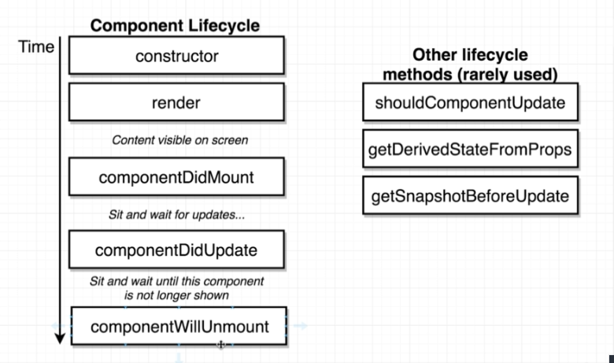
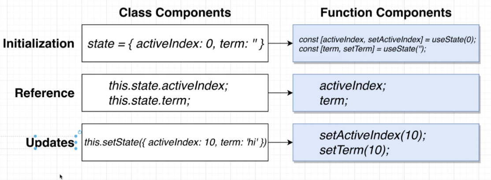
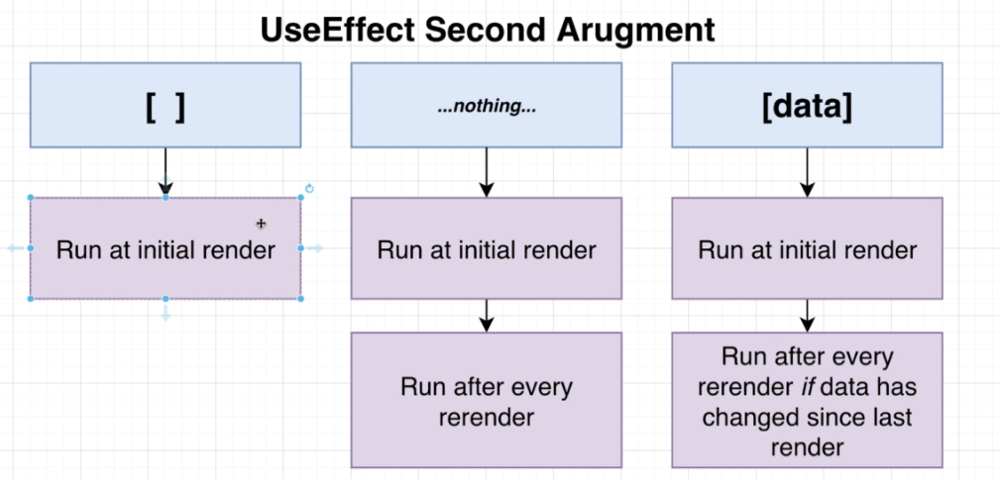
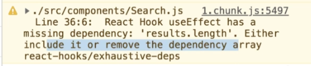
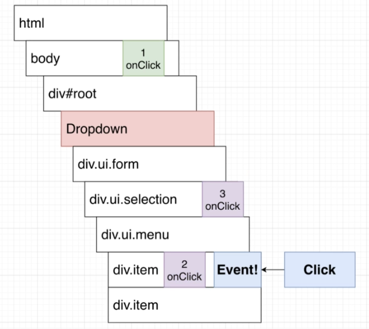

課程網址

https://www.udemy.com/course/react-redux/learn/lecture/12531046#overview


## 第1節：Let's Dive In!


hello world練習

https://codesandbox.io/s/react-yud4c?file=/src/App.js

create react app

https://create-react-app.dev/docs/getting-started/#quick-start

安裝create react app

`npm install -g create-react-app`

建立專案

`npx create-react-app my-app`

程式碼比較

https://www.diffchecker.com/


## 第 2 節： Building Content with JSX

可以線上測試將 JSX即時轉換為 js

https://babeljs.io/

HTML to JSX 使用Codepen

差異：

HTML

`<div style="background-color:white"></div>`

JSX

`<div style={{backgroundColor: 'white'}}></div>`

雙花括號第一個括號是宣告變數區塊、第二個括號是物件

`class`是 js的保留字，所以 JSX裡內用 `className`來取代（實際上不是真的會造成保留字的衝突，只是開發者當初在設計時想避免 coding時混肴、以及預防在不同開發工具上造成無法預期的錯誤）

`for` =>  `htmlFor` 取名原因同 `className`


## 第 3 節： Communicating with Props

課程範例採用的UI框架 https://semantic-ui.com/

三個 Component的強項：Nesting、Reusability、Configuration

產生假資料

https://github.com/marak/Faker.js/

巢狀Component中，子Component會作為props傳入父Component（概念類似於Vue的slot）

父Component引入子Componet在 JSX中的寫法：`{props.children}`


## 第4節：Structuring Apps with Class-Based Components

相較於Classed Component，Function Component天生較受限制 (restricted)，**沒有 lifecycle method系統和 state系統**，現今使用 hooks system來操作 lifecycle 和 state

function component 不能自動 rerender或暫停render動作（不能用非同步的方式取得資料來做render）


## 第5節：State in React Components

課程中用 html原生的 geolocation api（`window.navigator.gelocation.getCurrentPosition()`）來示範非同步程式，這個範例還蠻不錯的

State is a javascript object that contains some amount of data that is relevant to a singular component 

用更新state的方式來rerender component

只能用`setState` function來更新 state，**不能**直接對 state賦值。唯一的例外是在 `constructor`中初始化 state的時候才會直接賦值

`setState` 只能「新增」或「修改」state，不能「移除」state

Component必要的methods：

```js
class App extends React.Component {
  constructor (props) {
    super(props) // constructor可省略，但有寫的話必須要有super（繼承），並將props傳入super
  }
  // 必須宣告render否則會出錯
  render () {
    
  }
}
```


## 第6節：Understanding Lifecycle Methods



初始化渲染時的執行順序 render() -> componentDidMount()

初始化完成之後每次重新渲染的執行順序 render() -> componentDidUpdate()

建議不要在 `constructor`裡做取得 api資料（互非同步取資料）的動作，最好在 `componentDidMount`裡做，理由是讓 code比較簡潔

初始化 `state`的兩種寫法：

```js
class App Extends React.Component {
  contructor (props) {
    super(props)
    // 第一種寫法
    this.state = { lat: null, errorMessage: '' }
  }
  // 第二種寫法（影片說會經由babel編譯，不曉得這個是不是es6原生的語法？）
  state = { lat: null, errorMessage: '' }
}
```


講者習慣將 component最外層元素加上和 component相同名稱的 css class name


兩種設定 `props`預設值的方法

```js
const Spinner = (props) => {
  return (
  	// 略
    {props.message || 'Loading..'} // 第一種方法
  )
}
// 第二種方法
Spinner.defaultProps = {
  message: 'Loading..'
}
```

講者建議不要在 `render` function內寫多個 `return`

`render` function的 JSX可以抽出來寫成回傳 JSX的 function

```js
renderContent () {
	if (this.state.lat) {
		return <SeasonDisplay />
  } else {
    return <Spinner />
  }
}
render () {
  return {this.renderContent()}
}
```


## 第7節：Handling User Input With Forms and Events

事件properties：onClick, onChange, onSubmit...

```js
onInputChange (event) {
  console.log(event.target.value)
}

render () {
  return (
      <input
      type="text"
      onChange={this.onInputChange}
      onClick={(event) => console.log(event.target.value)}
    />
  )
}
```

**Controlled** vs **Uncontrolled** Element

以下例子說明什麼是 Controlled Element（我的理解以這個例子等同於Vue的雙向綁定）

```js
state = { term: '' }

render () {
  return (
    <input
      type="text"
      value={this.state.term}
			onChange={e => this.setState({ term: e.target.value })}
    />
  )
}
```

Controlled Element： `value`存放在 `state`

Uncontrolled Element： `value`存放在 dom裡面，必須要從 dom取出來後才能知道 value是什麼

我們應該將所有資訊存放在 Component內


`this`會指向到呼叫 (call) 該 function（或method）的對象身上，所以事件調用的 callback function中的 `this`會跑掉，找不到 component，如下範例

```js
state = { term: '' }

onFormSubmit (event) {
  console.log(this.state.term) // 'this' undefined
}

render () {
  return (
    <form onSubmit={this.onFormSubmit} >
    (略)
  )
}
```

*第 90集的範例說明的蠻清楚的

解決方式1

```js
constructor () {
  this.onFormSubmit.bind(this)
}
```

解決方式2（箭頭函式會自動綁定`this`到 function所在的物件上）

```js
onFormSubmit = (event) => {
  console.log(this.state.term) // 'this' undefined
}
```

解決方式3 - callback函式用箭頭函式再回傳一次（有點特別@@）

```js
render () {
  return (
    <form onSubmit={e => this.onFormSubmit()} >
    (略)
  )
}
```


子傳父的溝通方式：**調用父 Component傳入的 callback function**（做的事情等同Vue的 `emit`）


測試 js輸出結果的網頁

https://stephengrider.github.io/playgrounds/


## 第8節：Making API Requests with React

測試用的免費api

https://unsplash.com/


## 第9節：Building Lists of Records

跑迴圈做渲染的時候需要有一個 `key` property給 react作為索引

```js
const ImageList = props => {
  const images = props.images.map({ description, id, url} => {
    return 
  })
  return <div>{images}</div>
}
```


## 第10節：Using Ref's for DOM Access

這個章節介紹用 CSS Grid方法結合 react ref來製作瀑布式圖片列表，還蠻有趣的，有時間可以練習看看。但我覺得最後成果的高度間隔微小的不一致看起來還是有點不太順眼，不曉得有沒有更好的解法

`componentDidMount` 雖然已將 dom渲染上去，但圖片的渲染還沒真正完成

```js
constructor (props) {
  super(props)
  this.state = { spans: 0 }
  this.imageRef = React.createRef()
}
componentDidMount () {
  this.imageRef.current.addEventListener('load', this.setSpans)
}
setSpans = () => {
  const height = this.imageRef.current.clientHeight
  const spans = Math.ceil(height / 10)
  this.setState({ spans })
}
render () {
  const { description, urls } = this.props.image
  return (
    <div style={{ gridRowEnd: `span ${this.state.spans}` }}>
      
    </div>
  )
}
```


## 第12節：Understanding Hooks in React

React.Fragments 是一個可以不渲染出元素的標籤

```js
render() {
  return (
    <React.Fragment>
      <ChildA />
      <ChildB />
      <ChildC />
    </React.Fragment>
  );
}
```

callback function要傳入參數時的寫法如下

```js
// 會立刻被執行
<div onClick={onTitleClick(index)}>
// 用箭頭函式改寫成callback
<div onClick={() => onTitleClick(index)}>
```

`setState` 寫法



```js
import React, { useState } from 'react'

// const [<state>, <setter>] = useState(<default>)
const [activeIndex, setActiveIndex] = useState(null)
```


Wikipedia API

`en.wikipedia.org/w/api.php?action=query&list=search&format=json&srsearch=SEARCHTERM`


`useEffect` 我的理解他的功能就等同 Vue的 `watch`，第二個參數就是他監聽的對象



`useEffect` 的 callback function不能放 async function，要寫成以下幾種：

```js
// 方法1 - 影片的建議寫法
useEffect(() => {
  const search = async () => {
    await axios.get('...')
  }
  search()
}, [term])
// 方法2 - 立即函式
useEffect(() => {
  (async () => {
    await axios.get('...')
  })()
}, [term])
// 方法3 - Promise
useEffect(() => {
  axios.get('...')
  	.then((response) => {
  	}
}, [term])
```

字串轉為 html的方式（因有XSS攻擊風險所以property命名上特別提醒）

```js
<span dangerouslySetInnerHTML={{ __html: result.snippet }} />
```


164~168 講的好像比較像 `debounce` 不是 `throttle`。影片教學用 `useEffect`自己刻`throttle`（雖然我覺得是`debounce`）蠻有趣的


`useEffect` 中return callback function為 `clean up function`，會在下一次執行之前被調用


170 影片講者說為較進階議題可跳過。

如果在 `useEffect` 當中使用監聽對象以外的 `state` 或 `prop`，會跑出 warning告知需要將該變數加入監聽。



確實是有點複雜，雖然是看的懂，但不曉得有什麼其他的情況可以套用同樣的概念？以我的理解，react希望 `useEffect`的callback function不要依賴其他的狀態的原因是要避免 side effect，而講者提出來的解法是令外增加一個狀態，並額外增加一個 `useEffect`來監聽這個新的狀態，這樣就可以不需要依賴原先所依賴的外部狀態（看程式上確實是如此，但我也不曉得該如何解譯原理？）


用 hooks實作`Controlled Element`（同Vue雙向綁定）範例

```js
// 外層
export default () => {
  const [selected, setSelected] = useState(options[0])
  return (
  	<div>
    	<Dropdown
    		selected={selected}
				onSelectedChange={setSelected}
				options={options}
			/>
    </div>
  )
}
// Dropdown
const Dropdown = ({ options, selected, onSelectedChange }) => {
  const renderOptions = options.map((option) => {
    return (
    	<div
      	key={option.value}
        className="item"
				onClick={() => onSelectedChange(option)}
			>
        {option.label}
			</div>
    )
  })
  return (
  	// 略
  )
}
```


在 JSX 當中 `null`代表不會渲染任何東西，所以如果用`map`函式中要篩選掉某一項可以 return null（不過我覺得在組JSX前先用`filter`做好篩選應該是比較好的做法）


下拉選單點擊外面要關起來，影片的做法是在 html的 `body`中加入 `eventListener`捕捉 `bubble up`傳來的事件

```JS
useEffect(() => {
  document.body.addEventListener('click', () => {
      setOpen(false)
  })
}, []);
```

影片(182)說明 `body`上新增的監聽事件會第一個被執行，但是我聽不懂為什麼順序是這樣？



解法是「在事件中判斷點擊的 dom是 Dropdown當中的 dom還是以外的 dom」

```js
const ref = useRef()
useEffect(() => {
  document.body.addEventListener('click', () => {
    if (ref.current.contains(event.target)) {
      return
    }
    setOpen(false)
  })
}, []);
return (
	<div ref={ref}>
  略
)
```


## 順便筆記英文單字

### 程式相關

`scaffold` 腳手架/鷹架

`ternary expression` 三元運算子

`template string` 樣板字符，或稱 `backtick` 重音符號 → ``

`apostrophe` 撇號，或稱 `single quate` 單引號 → '

`destructure`, `destructure out` 解構

`parenthess` 括號

`invoke` 調用 e.g. Callback gets invoked

`plain text` 純文本


### 口語/一般單字

`put on` 放上

`very top of the page` 頁面最上方

`quick pause` 短暫休息一下

`flip back`,  `flip back over` 翻回來

`determine` 決定

`decline` 拒絕

`perspective` 看法

`usable` 可用的

`straightforward` 直接了當

`attempt` 試圖

`frequently` 頻繁

`hemisphere` 半球

`ultimate` 最終的

`repetitive` 重複的

`10 pixels away from...` 離... 10px

`this css file gets linked up to our project` 

`by default`

`indicate` 表明

`elegant` 優雅的

`deceptively` 欺騙性的

`tremendous number of` 大量的

`wrap up`,  `a quick wrap up` 快速總結

`tackle` 處理、對付

`convention` 慣例、傳統

`in particular` 特別是、尤其是

`precisely` 明確地

`segment` 段、一小部份

`settle` 定居、解決、安排 e.g. `we're goring to settle on one option` 我們將會決定一個選項

`singular` 單數、單個（強調特定的一個）

`distinct` 清楚的

`laid out` 佈置

`scrunch`, `scrunch down` 壓縮（排版上）

`adjust` 調整

`underneath` 下面

`we'll be all set` 我們要完成了

`tile` 磁磚

`consistent` 持續的

`misleading` 誤導